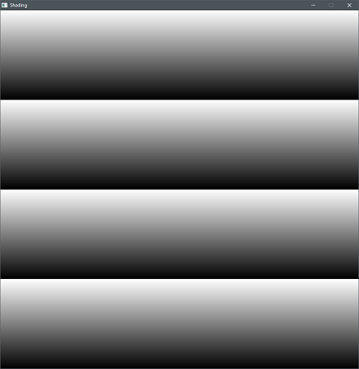
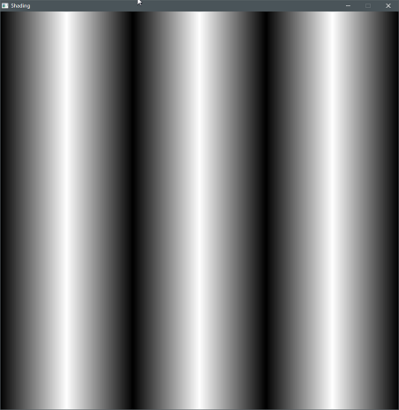
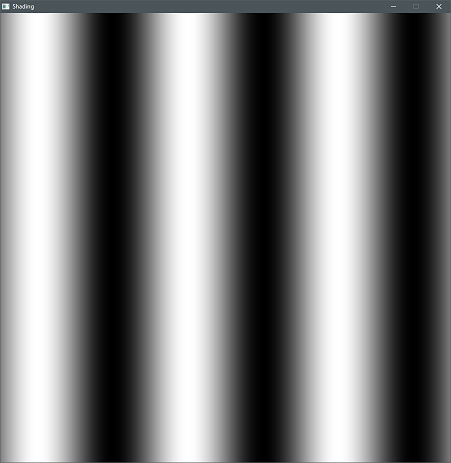
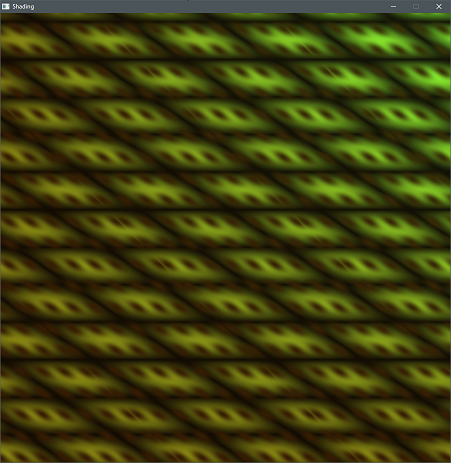
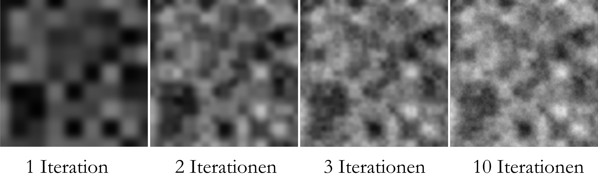

# Ausarbeitung Shading


Die für Shader in OpenGL verwendete Sprache ist GLSL (OpenGL Shading Language)
GLSL Shader werden grundsätzlich unterteilt in Vertex Shader, die die Darstellung und Position der tatsächlichen Geometrie im Raum steuern, sowie Fragment shader, die für Farbgebung, Lichteffekte etc. zuständig sind. Diese Ausarbeitung beschäft sich mit im Fragment Shader definierten Prozedurale Texturen.

## 1. Vektoren
Mit die wichtigsten Datenstrukturen in GLSL sind VeKtoren. Diese stellen einen Verbund aus je 2, 3 oder 4 Fließkommazahlen dar. Für Farben wird zum Beispiel meist entweder vec3 für Rot Grün und Blau, oder vec4 für Rot, Grün, Blau und Alpha verwendet.
Das Umwandeln von Vektortypen untereinander ist meist Problemlos, so kann z.b. mit
`vec4(MeinVec3, 1.0)` MeinVec3 zu Vec4 umgewandelt werden, wobei als vierter Wert 1 übergeben wird. Mit `vec3(MeinFloat)` wird MeinFloat an alle drei Kanäle des Vectors übergeben.


## 1. Texturkoordinaten
Um die Generierung von Prozeduralen Texturen zu ermöglichen sind Daten nötig, die vom Hauptprogramm an den Shader und somit die Grafikkarte übergeben werden. Abgesehen von der reinen Geometrie, die im Vertex Shader verarbeitet wird, ist Min#destvoraussetzung für Texturen auf Geometrie die Übergabe von Texturkoordinaten. Dabei wird ein vec(2) Wert übergeben - eine Datenstruktur aus zwei float Werten (x und y). Dieser stellt pro Pixel die Texturkoordinaten auf der Geometrie dar. Auf einem Würfel mit X als Rot und Y als Grün angezeigt, sehen die Texturkoordinaten zum Beispiel so aus:


## 2. Farbverläufe
Die wohl einfachste Form der Textur sind einfache Farbverläufe, die entweder die X oder Y Komponente der Texturkoordinaten als Verlauf auf derm Objekt darstellen.

```glsl
c = TexCoord.y;
```
> `c` steht hier immer für die entgültig als `vec4` (RGBA) augegebene Farbe - auch wenn das Beispiel `float` oder `vec3` ergibt.


<br>
mithilfe des Modulo Operators, können auch sich wiederhohlende Farbverläufe dargestellt werden:

```glsl
c = skalierung * mod(TexCoord.y, 1/skalierung);
```
Hirbei wird das Ergebniss zusätzlich noch mit der Skalierung multipliziert, um die Reichweite wieder auf 0 - 1 (schwarz - weiß) darzustellen.  


<br>

Um den Effekt auf und absteigender Verläufe zu erzielen, kann zusätzlich noch eine Kondition eingefügt werden, die den Wert >0.5 umkehrt und im Anschluss verdoppelt.
```glsl
c = scale * mod(TextCoord.x, 1/scale);
if (c > 0.5) {
    c = 1-f;
}
c *= 2;
```


<br>
Weichere Verläufe sind mit Sinus oder Cosinus moglich:

```glsl
c = (sin(TexCoord.x * skalierung * PI) + 1) / 2;
```
Zusätzlich muss der Wert um 1 erhöht und halbiert werden, um die Reichweite wieder auf 0 - 1 zu mappen.  


<br>

Durch Mischen dieser einfachen Funkionen in den verschiedenen Farbkanälen, lassen sich schon komplexere Muster erzeugen, wie zum Beispiel eine Schuppentextur.  


<br>

## 3. Animierte Texturen:
Über sogenannte Uniforms, können zusätzliche Werte aus dem Hauptprogramm an den Shader gegeben werden. Um animierte Texturen zu ermöglichen, kann zum Beispiel die Zeit übergeben werden.
Hier wird die Zeit zur Y-Koordinate hinzugefügt, um einen bewegten Farbverlauf zu erzeugen:

```glsl
c = (sin(TexCoord.y + time * skalierung * PI) + 1) / 2;
```
<br>

Interessante Effekte können auch mit der Übergabe der mittles GLFW ausgelesenen Mausposition erzielt werden, oder wenn die Kameraposition bestimmte Variablen der Textur steuert.

## 4. FBM und Perlin
Eine der wichtigsten prozeduralen Texturen für die Darstellung ist das sogenannte Perlin Noise Benannt wurde diese Technik nach dem Erfinder Ken Perlin, der für diese für den Film "Tron" entwickelte und einen Oscar gewann.

### 4.1 Random
Die Generierung von zufälligen Zahlen ist mit Computern nicht so einfach, wie es erscheinen mag. Meist werden dabei Algorithmen verwendet, die für einen bestimmten Startwert (Seed) eine pseudozufällige Zahl zurückgeben. Die im *Book od Shaders* definierte Funktion ist 
```
y = fract(sin(x)*1.0);
```

*The Book of Shaders: Random (thebookofshaders.com/10/)*

klein genug skaliert und auf das Skalarprodukt eines Inputvektorsangewandt und eines zweiten fest definierten Vektors folgt daraus ein homogenes Rauschen, wenn es z.b. wie hier direkt auf die Texturkoordinaten angewandt wird.

```glsl
// 2D Random
float random (in vec2 st) {
    return fract(sin(dot(st.xy,
        vec2(12.9898,78.233)))
            * 43758.5453123);
}
```


### 4.1 Noise
Um mithilfe dieser `Random` Funktion nun ein gleichmäsigeres Rauschen zu erzeugen, wird zunächst ein vec2 `i` erzeugt, der die Texturkoordinaten auf die darunterliegente ganzzahligen Integer rundet. Für daraus erbibt sich dann ein Gitter, welches Zellen je nach Skalierung der Textur besitzt und für jede Zelle einen X und Y Wert von 0-Skalierung definiert.

*Beispiel für Skalierung = 3*


Diese Werte werden dann verwendet, um einen zufälligen Wert pro Zelle zu generieren.


Das wird nun noch drei mal wiederholt, wobei die Koordinaten jeweils um 1 nach rechts, nach unten und nach rechts unten versetzt werden. Daraus ergeben sich die Bilder a,b,c und d.
  
Schließlich wird der Restwert von i (`fract`) ermittelt und mithilfe einer sogenannten quintic interpolation curve weicher dargestellt.  
  
Mit diesem Wert werden die vier Texturen dann prozentual gemischt, um einen Übergang zwischen den vier Texturen zu erzeugen.  


```glsl
// Aus Book Of Shaders -
// 2D Noise based on Morgan McGuire @morgan3d
// https://www.shadertoy.com/view/4dS3Wd
float noise(in vec2 st) {
    vec2 i = floor(st);

    // 4 Ecken erzeugen
    float a = random(i);
    float b = random(i + vec2(1.0, 0.0));
    float c = random(i + vec2(0.0, 1.0));
    float d = random(i + vec2(1.0, 1.0));

    vec2 f = fract(st);

    //quintic interpolation curve
    u = f*f*f*(f*(f*6.-15.)+10.);

    // 4 Ecken prozentual mischen
    return mix(a, b, u.x) +
            (c - a)* u.y * (1.0 - u.x) +
            (d - b) * u.x * u.y;
}
```
### 4.2 Iterationen
Mehrere Ergebnisse der oben beschriebenen Funktion, können nun übereinandergelegt werden um ein detailierteres Ergebnis zu erzielen. Dabei wird mit jeder weiteren sogen. Oktave die Skalierung erhöht (Textur verkleinert) und mit einem immer niedriger werdenden Wert (amplitude) zum bisherigen Ergebnis hinzugefügt.
Dieser iterative Prozess wird Fractal Brownian Motion - fbm Noise genannt.

  
 

```glsl
float fbm(in vec2 st, int OCTAVES) {

    float value = 0.0;
    float amplitude = .5;

    // Loop octaves
    for (int i = 0; i < OCTAVES; i++) {
        value += amplitude * noise(st);

        st *= 2.;           //Skalierung erhöhen
        amplitude *= .5;    //Amplitude verringern
    }
    return value;
}
```

## 5. Distortion
Mit den bisher gezeigten Möglichkeiten lassen sich nun bereits komplexe muster erzeugen. Eine oft genutzte Methode ist die Verzerrung (Distortion) der Texturkoordinaten selbst durch Texturen. Eine der einfachste Methoden ist der mix der Koordinaten und der entsprechenden Textur mit der `mix()` Funktion. Beispielsweise lässt sich durch die Anwendung von Noise verzerrter Texturkoordinaten auf Gradienten eine marmorähnliche Textur erzeugen:
```glsl
float noise = perlin(TexCoord*scale, octaves);
c = Gradients(mix(TexCoord.x, noise, distortionAmmount), scale);
```
  

Auch komplexere Muster sind möglich, wie zum etwa eine animierte Flammentextur
  
